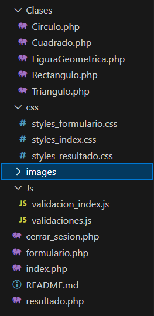

# Proyecto de Validación de Formulario: Figuras Geométricas

Este proyecto es una aplicación web que permite a los usuarios seleccionar una figura geométrica (triángulo, rectángulo, cuadrado o círculo) y valida que se haya realizado una selección antes de enviar el formulario. La aplicación está diseñada utilizando PHP para la lógica del servidor, JavaScript para las validaciones del lado del cliente y CSS para el estilo visual, proporcionando una experiencia de usuario intuitiva y dinámica.

## Objetivo del Proyecto

El objetivo principal de este proyecto es proporcionar una interfaz sencilla y efectiva para la selección de figuras geométricas y asegurarse de que los usuarios realicen una selección válida antes de proceder. Este tipo de validación es esencial en aplicaciones web para mejorar la usabilidad y evitar errores en el envío de formularios.

## Estructura del Proyecto

El proyecto está compuesto por la siguiente estructura de directorios y archivos:

### Descripción de los Archivos y Directorios

1. **Clases/**
   - Esta carpeta contiene las definiciones de las clases PHP que representan las figuras geométricas. Cada figura tiene su propia clase que extiende de una clase base para compartir atributos y métodos comunes.
   - **Circulo.php**: Define la clase `Circulo` con propiedades como radio y métodos para calcular área y perímetro.
   - **Cuadrado.php**: Define la clase `Cuadrado`, que incluye propiedades como lado y métodos para cálculos específicos de esta figura.
   - **FiguraGeometrica.php**: Clase base para todas las figuras geométricas, define atributos y métodos comunes que pueden ser heredados por las demás clases.
   - **Rectangulo.php**: Define la clase `Rectangulo`, con propiedades como base y altura, y métodos para calcular área y perímetro.
   - **Triangulo.php**: Define la clase `Triangulo`, que incluye propiedades como base y altura y métodos para sus cálculos específicos.

2. **css/**
   - Esta carpeta contiene los archivos CSS que definen el estilo visual de la aplicación.
   - **styles_formulario.css**: Estilos específicos para el formulario de selección de figuras, incluyendo diseño y formato.
   - **styles_index.css**: Estilos generales para la página principal, que incluye tipografía y disposición de los elementos.
   - **styles_resultado.css**: Estilos para la página de resultados, donde se mostrarán las figuras y sus cálculos.

3. **images/**
   - Carpeta destinada a contener las imágenes relacionadas con las figuras geométricas utilizadas en la interfaz. Esto incluye imágenes representativas de cada figura seleccionada en el formulario.

4. **Js/**
   - Contiene los archivos JavaScript responsables de las validaciones del formulario, mejorando la experiencia del usuario al proporcionar retroalimentación instantánea.
   - **validacion_index.js**: Lógica de validación para el formulario en la página principal. Este archivo asegura que el usuario seleccione una figura antes de enviar el formulario.
   - **validaciones.js**: Funciones de validación adicionales que pueden ser utilizadas en otras páginas, permitiendo una reutilización del código.

5. **cerrar_sesion.php**
   - Archivo PHP que maneja la lógica de cierre de sesión para el usuario. Garantiza que la sesión se cierre correctamente y redirige al usuario a la página principal o a una página de inicio de sesión.

6. **formulario.php**
   - Este archivo procesa la figura seleccionada por el usuario una vez que el formulario es enviado. Realiza cálculos en función de la figura seleccionada y muestra resultados en la página de resultados.

7. **index.php**
   - Página principal donde el usuario puede seleccionar una figura geométrica. Aquí se muestra el formulario y se implementan las validaciones en el lado del cliente.

8. **resultado.php**
   - Página que muestra los resultados después de que se ha enviado el formulario. Dependiendo de la figura seleccionada, se muestran cálculos como el área y el perímetro.

## Funcionamiento de la Aplicación

1. **Interacción del Usuario**: Al cargar la página `index.php`, el usuario se encuentra con un formulario que le permite seleccionar una figura geométrica. Cada figura está representada por un botón de opción (radio button) acompañado de una imagen descriptiva.

2. **Validación al Enviar el Formulario**:
   - Cuando el usuario intenta enviar el formulario, se invoca la función de JavaScript (`validacion_index.js`) que valida si se ha seleccionado alguna figura.
   - Si no se ha realizado ninguna selección, se muestra un mensaje de error en el formulario y se evita que el formulario se envíe.

3. **Procesamiento del Formulario**:
   - Si se selecciona una figura, el formulario se envía a `formulario.php`, donde se manejan los datos enviados y se realizan los cálculos necesarios en base a la figura seleccionada.
   - Los resultados se envían a `resultado.php`, que presenta los cálculos al usuario.

## Validaciones

Las validaciones del formulario se realizan en el lado del cliente utilizando JavaScript. El archivo `validacion_index.js` incluye la lógica para verificar que se haya seleccionado una figura antes de permitir el envío del formulario. A continuación se describen las funciones de validación:

- **validarSeleccionFigura()**: Esta función revisa los botones de opción de las figuras geométricas y retorna `true` si al menos uno está seleccionado, o `false` en caso contrario.
- **mostrarErrorFigura(mensaje)**: Muestra un mensaje de error en la interfaz si no se selecciona ninguna figura, permitiendo que el usuario sepa que debe realizar una selección.

## Tecnologías Utilizadas

- **HTML**: Para estructurar la página y crear formularios semánticos.
- **CSS**: Para el diseño y el estilo visual de la aplicación, asegurando que sea atractiva y fácil de usar.
- **JavaScript**: Para realizar validaciones en el lado del cliente y mejorar la experiencia del usuario mediante la retroalimentación inmediata.
- **PHP**: Para manejar la lógica del servidor, procesar datos y mantener la sesión del usuario.

## Autor

- **Nombre del autor**: Aina Orozco

